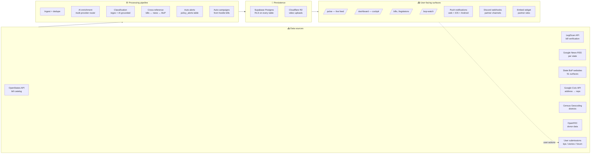
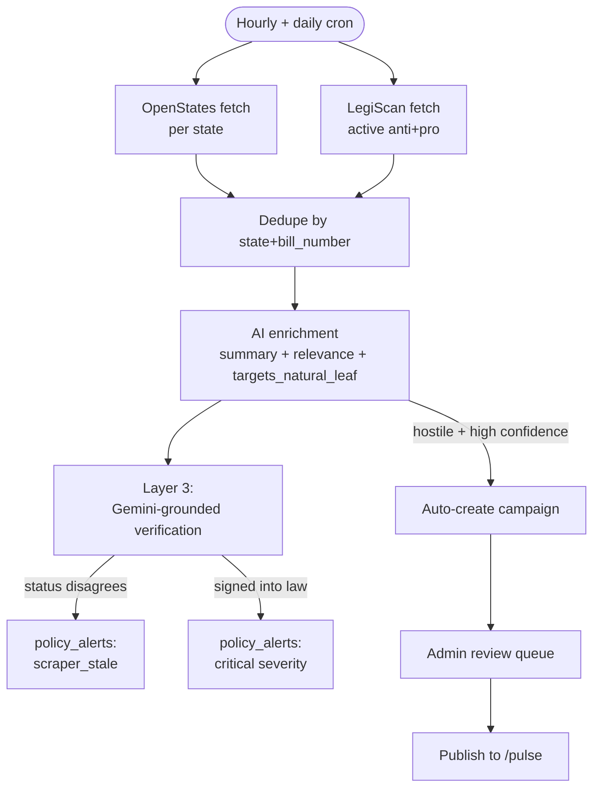
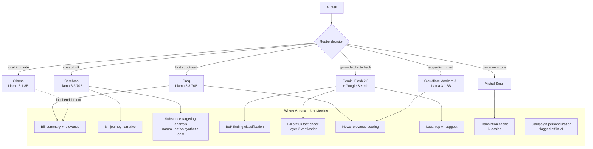
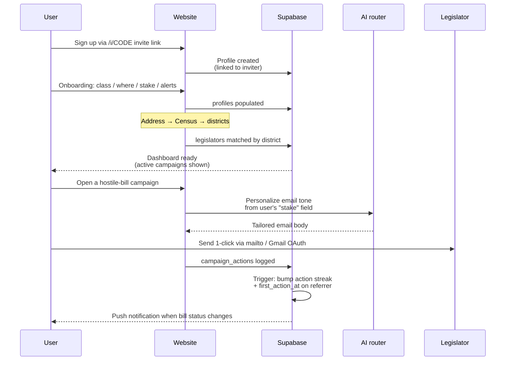
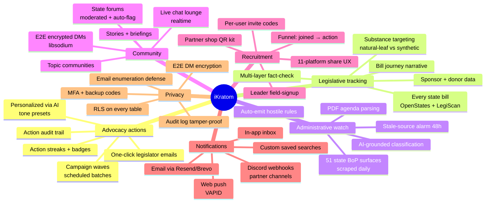
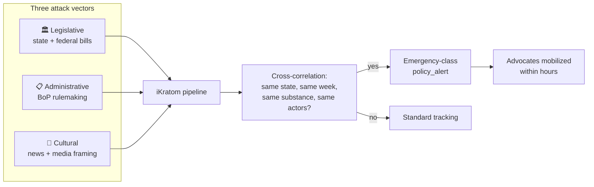
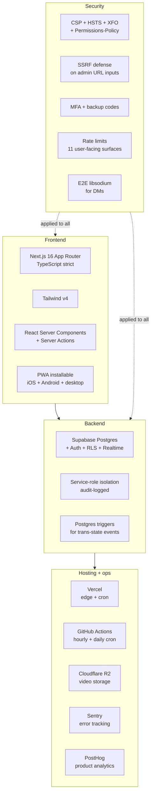
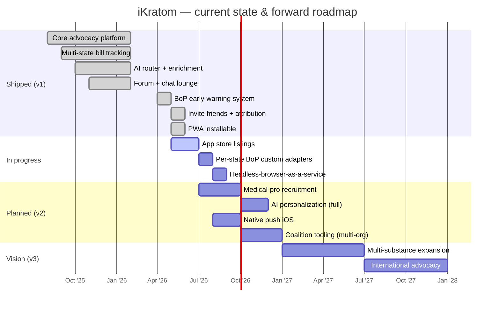

# iKratom — Architecture, Capability Surface & Vision

> **Public technical overview.** Safe to share with developers, investors, potential partners.
> Internal security details, env vars, project IDs, and proprietary thresholds excluded.
> Last updated: 2026-05-12.

---

## What it is in one line

**iKratom is the advocate's toolbelt** — a nonpartisan civic-action platform that turns hours of legislative tracking, rep outreach, and rule-change watching into minutes a day, with one-click actions backed by real-time data from every U.S. state.

It's the operational backbone for an unfunded, distributed, mostly-volunteer advocacy community defending a botanical that's under simultaneous administrative + legislative + cultural pressure.

---

## Numbers at a glance

| | Coverage |
|---|---|
| U.S. states monitored (legislative + regulatory) | **50 + DC + federal** |
| State Board of Pharmacy surfaces scraped daily | **51** (47 via Node fetch, 4 via headless Chromium) |
| AI providers in the routing layer | **5** (Gemini, Groq, Cerebras, Mistral, Cloudflare AI) + local Ollama |
| Free-tier APIs integrated | **8+** (OpenStates, LegiScan, Google Civic, Census, HIBP, Resend, etc.) |
| User actions per legislator email | **1 click** |
| End-to-end encrypted feature | **Direct messages** (libsodium / Curve25519 + XChaCha20-Poly1305) |
| Migrations applied to schema | **102+** |
| Production deploys this month | **30+** (Vercel CI) |
| Tables under Row Level Security | **62 of 62** in `public` schema |

---

## System architecture — the 10,000-ft view



---

## Data ingestion pipeline

### Bills (legislative track)



### Board of Pharmacy (administrative track — the second front)

```mermaid
flowchart TB
  start([Daily cron])
  start --> scrape{Adapter}
  scrape -->|47 sites| nodef[Node fetch + Chrome headers]
  scrape -->|4 TLS-blocked| pw[Playwright Chromium<br/>via GitHub Actions]
  nodef --> findings[bop_findings table]
  pw --> findings
  findings --> pdf[Layer 1.5:<br/>Download + parse PDFs]
  pdf --> regex[Layer 1:<br/>Regex keyword classifier<br/>kratom_direct / adjacent]
  regex --> ai[Layer 2:<br/>Gemini grounded re-classify<br/>reads linked content + cross-refs]
  ai -->|conf ≥0.85 + hostile + 2-signal| autoemit[Auto-emit policy_alert]
  ai -->|all other direct findings| admin_notify[Admin push notification]
  autoemit --> pulse[/pulse live feed]
  ai --> bop_watch[Public /bop-watch page]
  findings --> bop_watch
```

### News + intel

```mermaid
flowchart LR
  rss[Google News RSS<br/>51 scopes] --> sync[Daily sync]
  user[User intel tips<br>/alerts/submit] --> review[Admin intel queue]
  sync --> classify[AI relevance scoring]
  classify --> news[news_items table]
  review --> news
  news --> pulse[/pulse news widget]
  news --> alerts{Auto-trigger<br/>kratom_direct +<br/>high-severity?}
  alerts -->|yes| policy[policy_alerts]
  alerts -->|no| quiet[stays in /news]
```

---

## AI infrastructure

The platform uses a **multi-provider router** that picks the right LLM for each job based on cost, latency, capability, and live quota.



**Quota strategy**: ~80 Gemini grounded calls/day (well under 1500/day free tier), most other work routes to Groq/Cerebras free tiers. All AI jobs logged to `ai_jobs` table for cost + activity tracking on `/admin/ai-control`.

---

## User journey (signed-up advocate)



---

## Features by user role

| Capability | Anon | Signed-in | Leader | Admin | Owner |
|---|:-:|:-:|:-:|:-:|:-:|
| Browse pulse / bills / news / library | ✓ | ✓ | ✓ | ✓ | ✓ |
| `/bop-watch` early-warning view | ✓ | ✓ | ✓ | ✓ | ✓ |
| Read briefings | ✓ | ✓ | ✓ | ✓ | ✓ |
| Send 1-click campaign actions | | ✓ | ✓ | ✓ | ✓ |
| Encrypted DMs | | ✓ | ✓ | ✓ | ✓ |
| Forum participation | | ✓ | ✓ | ✓ | ✓ |
| Custom saved searches | | ✓ | ✓ | ✓ | ✓ |
| Email tone presets | | ✓ | ✓ | ✓ | ✓ |
| Personal invite link + funnel stats | | ✓ | ✓ | ✓ | ✓ |
| Submit intel tip / story | | ✓ | ✓ | ✓ | ✓ |
| Field-signup (recruit advocates in person) | | | ✓ | ✓ | ✓ |
| Author a campaign | | | ✓ | ✓ | ✓ |
| Add local officials | | | ✓ | ✓ | ✓ |
| Add library items | | | ✓ | ✓ | ✓ |
| Approve / reject pending campaigns | | | | ✓ | ✓ |
| Manual bill add | | | | ✓ | ✓ |
| Manage users + permissions | | | | ✓ | ✓ |
| Sync triggers + AI cost dashboard | | | | ✓ | ✓ |
| BoP source URL editing | | | | ✓ | ✓ |
| Emergency-mode site banner | | | | ✓ | ✓ |
| Ownership transfer | | | | | ✓ |
| Granular permission matrix (21 perms × 6 cats) | | | | | ✓ |

---

## Core capability surface



---

## The threat-detection thesis

Kratom faces **three simultaneous attack vectors**. The platform watches all three and cross-correlates.



**Example**: a single state moves on ALL THREE in one week (BoP files scheduling petition, AG announces investigation, news syndicates "gas-station heroin" framing). Today: a typical advocate would catch one of the three from local news, days late. With iKratom: all three surface in one place, with one-click responses, the same day.

---

## Tech stack



---

## Vision & roadmap



---

## Why now

**Three pressures converging.**

1. **Administrative regulatory drift**: state Boards of Pharmacy are quietly moving on emerging substances faster than legislatures, with less public visibility. Without continuous monitoring, advocates find out the week a rule takes effect.

2. **AI-enabled tooling makes per-state tracking actually possible**: free-tier LLM access (Gemini grounding, Groq, Cerebras) means we can fact-check 50 states' bill statuses every day for $0. Five years ago this took a team of analysts.

3. **Civic engagement floor is collapsing**: people respond to "one tap" but not to "look up your rep + draft an email + find their address + format it correctly". The friction reduction matters more than ever.

The advocacy community for kratom is large, decentralized, and almost entirely run by unpaid volunteers. A platform that turns hours of work into minutes scales their existing energy by an order of magnitude.

---

## What this is not

- **Not partisan.** Doesn't favor any of the existing kratom advocacy orgs (AKA, GKC, BAE, MAC). The platform is a tool, not a faction.
- **Not a CRM** for advocacy orgs. It empowers individual advocates directly.
- **Not a paid SaaS.** Free-tier-only for v1; sustainable on community donations + partner shop sponsorships.
- **Not a social network.** Forum and DMs exist but the point is action, not engagement metrics.

---

## What we're asking partners + investors + developers to know

- The codebase ships **multiple production PRs per day**, with CI/CD, security headers, audit logs, RLS, MFA, and append-only audit triggers — built like a venture-scale product, run on a free-tier budget.
- The data pipeline is **defensible**: 51 state BoP sources scraped + AI-classified + cross-correlated with bill data is genuinely hard to replicate.
- The community moat is the **network effect of attribution** — every user has a personal invite link with funnel tracking, growing organically without paid acquisition.
- The vision extends past kratom — the **3-vector threat-detection pattern** (legislative + administrative + cultural) applies to any embattled botanical or supplement category.

---

_Built and maintained by one operator + Claude (AI co-developer). Codebase at: `github.com/ohjustadam/ikratom` (private until v2 launch). Investor / partner inquiries: ohjustadam@proton.me._
